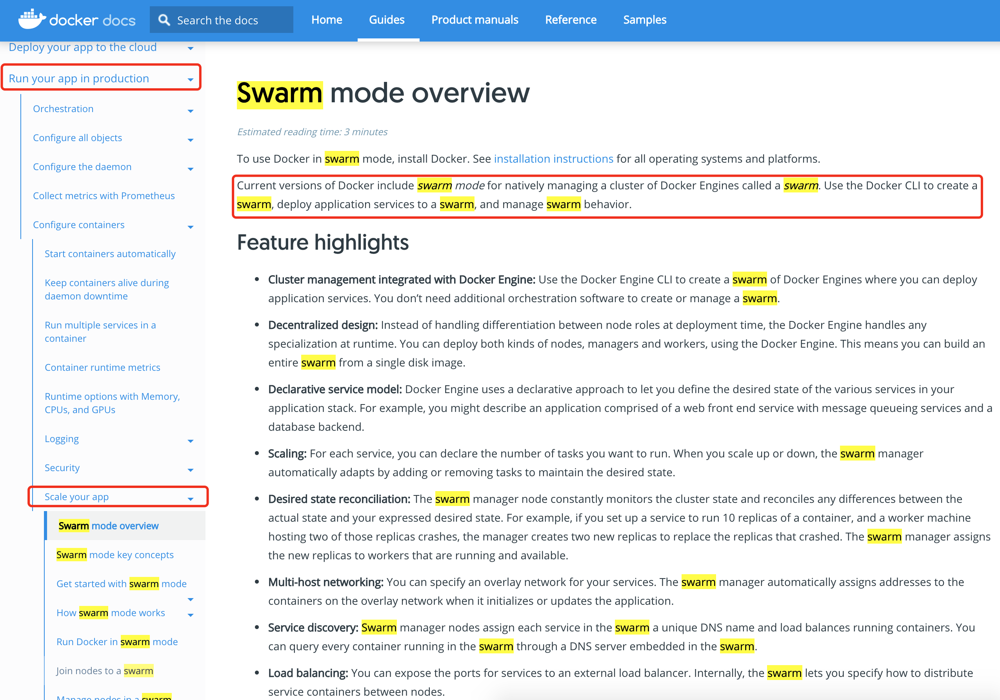

# Docker Swarm


## Swarm是啥？

根据官网上的说明，*Swarm是当前Docker版本一种原生的管理Docker引擎集群的模式。使用Docker CLI可以在swarm中部署应用、管理Swarm的行为。*

Swarm概念的出现是为了"Scale your app"。



Docker Swarm 主要包含两方面内容：一个企业级的Docker安全集群，一个微服务应用编排引擎。


## Swarm环境部署


swarm是由一个或者多个Docker节点组成，这些节点需要通过可靠的网络相连。这就要求节点要安装Docker,第二要网络相通，以便swarm集群内通信。

**节点(Node)类型**

* 工作节点(WORKER):接收来自管理节点的任务并执行。

* 管理节点(MANAGER):负责集群控制面(Control Plane)。

**环境准备**

准备6个节点(物理服务器、虚拟机、树莓派、云实例)，包含3个管理节点和3个工作节点。

**部署步骤**

初始化 --> 加入额外的管理节点 --> 加入工作节点

```shell
# swarm初始化，将节点切换为swarm模式
docker swarm init --advertise-addr 10.0.0.1:2377 --listen-addr 10.0.0.1:2377

# 列出Swarm中的节点
docker node ls

# 查询加入manager的token指令
docker swarm join-token manager

# 查询加入worker的token指令
docker swarm join-token worker

```


## Swarm HA 特性

Swarm使用了Raft共识算法来支持管理节点(Manager)的HA。

**最佳实践原则**：

* 部署奇数个管理节点，防止脑裂(Split-Brain)

  假设有4个管理节点，当网络发生分区时，可能每个分区都有两个管理节点，每个分区都无法知道其余两个节点能否正常运行，无法得知分区是否掌握了大多数(Quorum)。集群虽然存在且在运行，但是无法变更配置、增加和管理应用负载。

* 不要部署太多管理节点（3、5），共识效率

