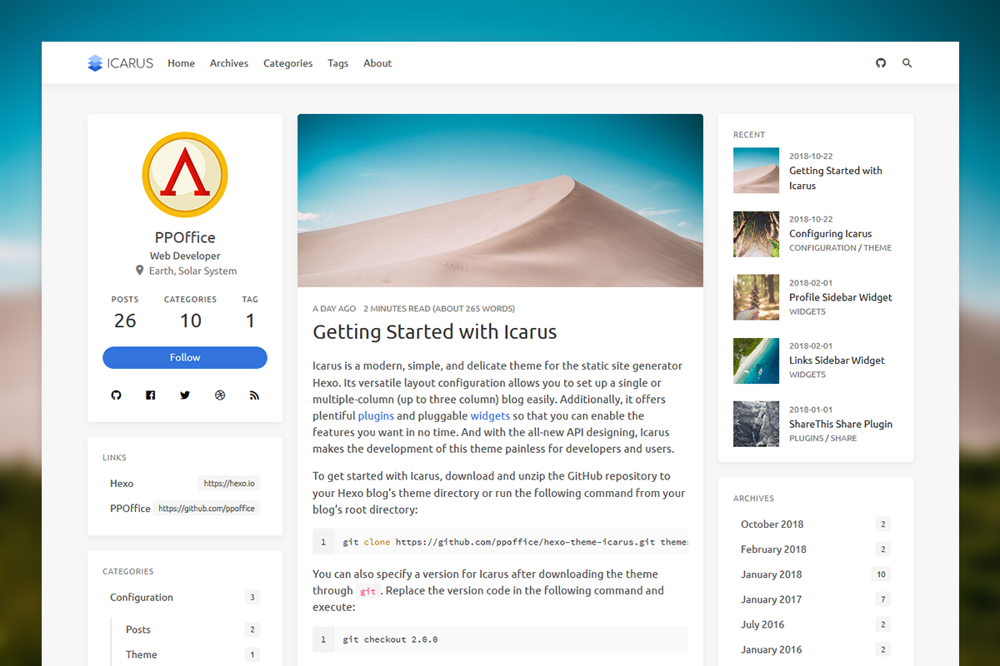

搭建博客说明

## Hexo

### 安装说明

使用hexo构建博客前，首先要安装hexo相关支持组件。Hexo基础的支持环境就是NodeJS。

* 安装NodeJS

* 安装Hexo

  ```shell npm install -g hexo-cli
  npm install -g hexo-cli
  ```

  

### 基础指令

#### 建站初始化

```shell
$ hexo init <folder>
$ cd <folder>
$ npm install
--------- 构建结果 ----------
.
├── _config.yml
├── package.json
├── scaffolds
├── source
|   ├── _drafts
|   └── _posts
└── themes

```


#### 常用指令

```shell
hexo new [layout] title # 新建文章
hexo generate # 生成静态文件
hexo server # 启动服务器
```

### 主题设置

#### 使用主题

[Icarus](https://github.com/ppoffice/hexo-theme-icarus)



1. 下载主题到本地

   ```shell
   git submodule add https://github.com/ppoffice/hexo-theme-icarus.git themes/icarus
   ```

2. 配置`_config.yml`文件

   ```shello
   theme: icarus
   ```

3. 配置`_config_icarus.yml`文件

   ```shell
   1. 移除google广告挂件
   2. 移除打赏、分享挂价
   3. 启用Gitalk作为评论仓库
   ```

#### Gitalk

##### 创建OAuth Apps


##### 创建评论仓库


##### 配置comment

`_config_icarus.yml` 中尤其要注意**proxy**配置,否则403.

```shell
proxy: 'https://netnr-proxy.cloudno.de/https://github.com/login/oauth/access_token'
```


## github

#### 账号的建立

参考其他github账号申请与创建的步骤

#### github.io项目创建

项目名称为**lingodan.github.io**,自行创建需要更换为自己的用户名；


## Travis-CI

使用Travis完成持续集成设置。

1. 使用Github账户登录Travis-CI网站https://travis-ci.com/

2. 在项目根路径下新建`.travis.yml`文件

   ```shell
   sudo: false
   language: node_js
   node_js:
     - 12 
   cache: npm
   branches:
     only:
       - master # build master branch only
   before_install:
   - export TZ='Asia/Shanghai'
   - npm install -g hexo-cli
   - npm install
   install:
   - npm install
   script:
   - hexo clean
   - hexo generate # generate static files
   deploy:
     provider: pages
     skip-cleanup: true
     github-token: $GH_TOKEN  # GH_TOKEN在github申请，在Travis页面配置
     keep-history: true
     on:
       branch: master  # 监控master分支变化
     local-dir: public
   ```

3. 申请Github Personal access tokens 

   

4. Travis 页面配置GH_TOKEN

以上完成Travis对于项目的配置。当Github项目更新时，Travis会收到任务，触发编译任务。
